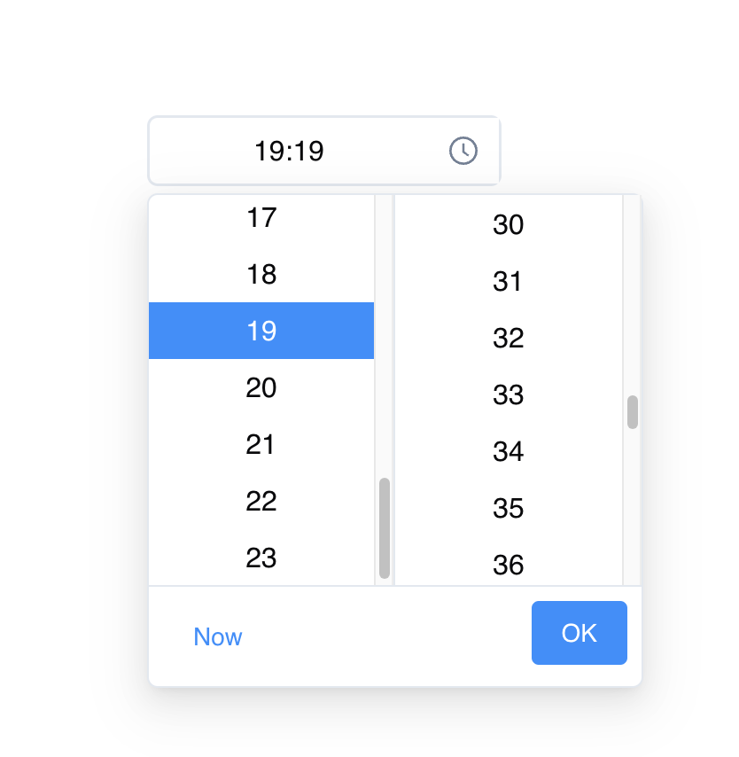

# Chakra Time Picker

A beautiful and customizable time picker component for React using Chakra UI v3. Inspired by Ant Design's aesthetics with a modern, clean interface.



## Installation

```bash
npm install chakra-time-picker
# or
yarn add chakra-time-picker
# or
pnpm add chakra-time-picker
```

## Requirements

This component requires the following peer dependencies:

- React 17 or higher
- Chakra UI 3.0 or higher
- @emotion/react 11.0 or higher
- @emotion/styled 11.0 or higher
- framer-motion 12.0 or higher

## Usage

### Basic Usage

```jsx
import { TimePicker } from "chakra-time-picker";
import { useState } from "react";

function App() {
  const [time, setTime] = useState("12:00");

  return (
    <div>
      <h1>Time Picker Example</h1>
      <TimePicker value={time} onChange={(newTime) => setTime(newTime)} />
      <p>Selected time: {time}</p>
    </div>
  );
}
```

### With ChakraProvider

```jsx
import { ChakraProvider } from "@chakra-ui/react";
import { TimePicker } from "chakra-time-picker";
import { useState } from "react";

function App() {
  const [time, setTime] = useState("12:00");

  return (
    <ChakraProvider>
      <div>
        <h1>Time Picker Example</h1>
        <TimePicker value={time} onChange={(newTime) => setTime(newTime)} />
        <p>Selected time: {time}</p>
      </div>
    </ChakraProvider>
  );
}
```

## Features

- **Modern Interface**: Clean, intuitive design inspired by Ant Design
- **24-hour time format**: Shows hours (00-23) and minutes (00-59)
- **Two-column selection**: Easy selection of hours and minutes
- **Custom Styling**: Fully customizable with Chakra UI theme
- **TypeScript Support**: Full TypeScript support with type definitions
- **Keyboard Accessibility**: Accessible via keyboard navigation
- **"Now" Button**: Quickly set current time
- **Smooth Animations**: Clean, polished UI transitions

## Component Design

The time picker consists of:

1. **Input field**: Displays the selected time and opens the dropdown when clicked
2. **Hours column**: Displays hours from 00-23
3. **Minutes column**: Displays minutes from 00-59
4. **Action buttons**:
   - "Now" - Sets the time to current time
   - "OK" - Confirms the selection and closes the dropdown

## Props

| Prop        | Type     | Required | Default       | Description                                |
| ----------- | -------- | -------- | ------------- | ------------------------------------------ |
| value       | string   | Yes      | "00:00"       | The current time value in "HH:MM" format   |
| onChange    | function | Yes      | -             | Callback function called when time changes |
| width       | string   | No       | "200px"       | Width of the time picker input             |
| placeholder | string   | No       | "Select time" | Placeholder text when no time is selected  |
| disabled    | boolean  | No       | false         | Disables the time picker when true         |
| isReadOnly  | boolean  | No       | false         | Makes the time picker read-only when true  |

## Customization

You can customize the TimePicker by adding Chakra UI props to the component.

```jsx
<TimePicker
  value={time}
  onChange={setTime}
  width="240px"
  borderRadius="lg"
  _hover={{ borderColor: "purple.400" }}
  _focus={{
    borderColor: "purple.500",
    boxShadow: "0 0 0 2px rgba(159,122,234,0.2)",
  }}
/>
```

## Browser Support

- Chrome (latest)
- Firefox (latest)
- Safari (latest)
- Edge (latest)

## Contributing

Contributions are welcome! Please feel free to submit a pull request.

1. Fork the repository
2. Create your feature branch (`git checkout -b feature/amazing-feature`)
3. Commit your changes (`git commit -m 'Add some amazing feature'`)
4. Push to the branch (`git push origin feature/amazing-feature`)
5. Open a Pull Request

## License

MIT

## Author

Tuan Le Hoang - @tuanlehoang

## Acknowledgements

- Design inspired by Ant Design
- Built with Chakra UI v3
